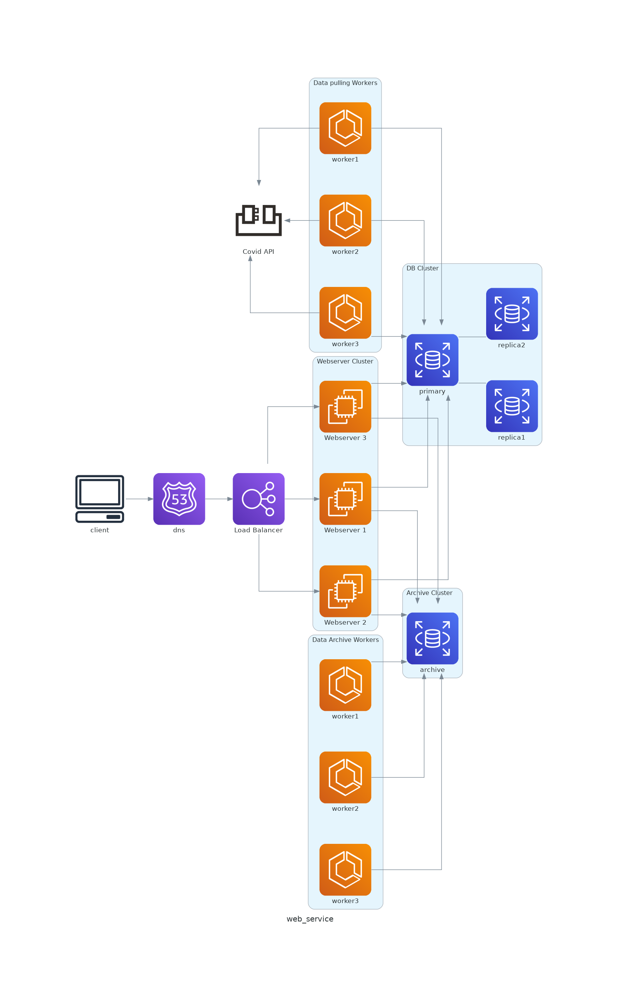

# Design Covid19 System

## Step 1: Outline use cases and constraints

> Gather requirements and scope the problem.
> Ask questions to clarify use cases and constraints.
> Discuss assumptions.

Without an interviewer to address clarifying questions, we'll define some use cases and constraints.

### Use cases

#### We'll scope the problem to handle only the following use cases

* **Anonymous User**  view public data
* **Registered User** advanced data, vaccination
* **Service** show summary and detail from the world's covid 19 data
    * Public data Updates hourly
    * Allow user signup to vaccination
        * Fill profile and location
        * search for nearby hospital
    * Analyzes daily increase, by country/city
* **Service** has high availability

#### Out of scope

* **Service** performs additional logging and analytics

### Constraints and assumptions

#### State assumptions

* Datasource is public and stable
* Traffic is not evenly distributed
* Automatic hourly update of regions 
* * Automatic daily archive of the pass day and keep at least 2 year
* Budget notifications don't need to be instant
* 10 million Anonymous users
* 1 million needs vaccination
* 1:10 write to read ratio
    * read-heavy, users view data eveytime, but few vaccination was made on the sametime

#### Calculate usage

* summary for city row:per country/city update hourly base on data_hour(2021_03_13_11)
* user profile row: each peoson has 1 row
* vaccination row: each peoson has 0-3 rows

Handy conversion guide:

* 2.5 million seconds per month
* 1 request per second = 2.5 million requests per month
* 40 requests per second = 100 million requests per month
* 400 requests per second = 1 billion requests per month

## Step 2: Create a high level design

> Outline a high level design with all important components.

## Step 3: Design core components

> Dive into details for each core component.

